# Documentação de Arquitetura de Software: Padrão MVP em Delphi

| Versão | Data | Autor |
|-|-|-|
| 1.0 | 26 de junho de 2025 | Gemini |
| 1.1 | 26 de junho de 2025 | Ricardo Gonçalves |

## 1. Objetivo
Este documento estabelece a arquitetura padrão para o desenvolvimento de novas funcionalidades do sistema. O objetivo principal é resolver problemas comuns em aplicações VCL legadas, como o acoplamento de código, a mistura de responsabilidades (UI, regras de negócio, acesso a dados) e a baixa testabilidade.

A arquitetura adotada é a **Model-View-Presenter (MVP)**, que promove uma clara separação de camadas, resultando em um software mais robusto, manutenível, testável e flexível.

## 2. Princípios Fundamentais
A arquitetura se baseia nos seguintes princípios de engenharia de software:

- **Separação de Responsabilidades (SoC)**: Cada classe ou camada tem uma única responsabilidade. A interface do usuário (View) não conhece as regras de negócio; o serviço de negócio (Model/Service) não conhece a UI; e a camada de dados não conhece nenhuma das duas.

- **Baixo Acoplamento e Alta Coesão**: Os componentes são o mais independentes possível (baixo acoplamento). As funcionalidades relacionadas estão agrupadas de forma lógica (alta coesão).

- **Injeção de Dependência (DI)**: As dependências (como um serviço de log ou de acesso a dados) não são criadas dentro das classes que as utilizam. Em vez disso, são "injetadas" de fora, geralmente via construtor. Isso é facilitado pelo uso de interfaces.

- **Testabilidade**: A separação da lógica de negócio da UI permite a criação de testes de unidade (DUnit) para validar as regras do sistema sem a necessidade de interação manual com as telas.

## 3. Visão Geral da Arquitetura (MVP)
O padrão Model-View-Presenter divide a funcionalidade em três papéis distintos:

- **Model (Modelo)**: Representa a camada de dados e de lógica de negócio. Em nossa implementação, ela é dividida em:
  - **Objetos de Domínio** (ex: `TCliente`): Classes simples que carregam os dados.
  - **Serviços** (Service) (ex: `TClienteService`): Contêm as regras de negócio, validações e orquestram as operações.  
  - **Acesso a Dados** (Data Access) (ex: `TDMClientes`): Responsável exclusivamente pela comunicação com o banco de dados.

- **View (Visão)**: A interface do usuário (ex: `TFormPesquisaClientes`). É "passiva" e "burra". Suas únicas responsabilidades são exibir dados e capturar eventos do usuário (clicks, digitação), delegando qualquer processamento ao Presenter.

- **Presenter (Apresentador)**: O cérebro da operação. Atua como um intermediário que conecta a View ao Model. Ele recebe os eventos da View, aciona a lógica no Service, recebe os dados de volta e formata-os para serem exibidos na View.


### Diagrama de Componentes
Este diagrama ilustra a relação estática entre os principais componentes do nosso exemplo de "Cadastro de Clientes".


## 4. Detalhamento dos Componentes

### 4.1. Interfaces (`Cliente.Interfaces.pas`, `Logger.Interfaces.pas`)
As interfaces são o contrato que garante o baixo acoplamento.

- `ILogger`: Define o que um serviço de log deve fazer (`LogInfo`, `LogError`), mas não como. Permite trocar um log de arquivo por um de banco de dados sem alterar nenhuma outra parte do sistema.
- `IClienteView`, `IClientePesquisaView`: Definem as propriedades e métodos que a View **deve** expor para o Presenter (ex: `GetNome`, `SetNome`, `GetDataSource`). Isso permite que o Presenter trabalhe com a View sem conhecer sua classe concreta (`TForm`), o que é essencial para testes.
- `IClientePresenter`, `IClientePesquisaPresenter`: Definem as ações que a View pode solicitar ao Presenter (ex: `Salvar`, `Pesquisar`).

### 4.2. A Camada de Apresentação (View)
- **Responsabilidade**: Exibir dados e capturar interações do usuário.

- **Implementação**: TFormPesquisaClientes e TFormCadastroCliente.

- **Características**:
  - Implementa a interface de **View** correspondente.
  - Contém os componentes visuais (`TDBGrid`, `TEdit`, `TButton`).
  - **Não contém nenhuma regra de negócio**.
  - Os eventos de clique dos botões são, em geral, uma única linha que chama o método correspondente no **Presenter**.
  - Exemplo:
    ```delphi
    procedure TFormPesquisaClientes.btnPesquisarClick(Sender: TObject);
    begin
      FPresenter.Pesquisar;
    end;
    ```


### 4.3. O Apresentador (Presenter)
- **Responsabilidade**: Orquestrar a comunicação entre a **View** e o **Model**.

- **Implementação**: `TClientePesquisaPresenter` e `TClientePresenter`.

- **Características**:
  - Recebe a interface da **View** (`I...View`) e a instância do **Service** no seu construtor.
  - Contém a lógica de apresentação: "Quando o usuário clicar em Editar, pegue o ID da **View**, chame o método da View para abrir a outra tela, passando o ID".
  - Recebe dados do **Service** e os envia para a **View** de forma simples para que ela possa exibi-los.


### 4.4. A Camada de Lógica (Service)
- **Responsabilidade**: Implementar e garantir as regras de negócio do sistema.

- **Implementação**: `TClienteService`.

- **Características**:
  - É uma classe `TObject` pura. Não conhece e não deve conhecer nenhuma classe da VCL.
  - Recebe suas dependências (Logger, Data Access) via construtor.
  - Contém os métodos centrais da funcionalidade (`Salvar`, `Carregar`, `Listar`).
  - É aqui que as validações ocorrem (ex: "O nome do cliente não pode ser vazio").
  - É aqui que a lógica de log é invocada.


### 4.5. A Camada de Dados (Data Access)
- **Responsabilidade**: Exclusivamente ler e escrever no banco de dados.

- **Implementação**: `TDMClientes` (um `TDataModule`).

- **Características**:
  - Centraliza todos os componentes de acesso a dados (`TADOConnection`, `TADOQuery`).
  - Expõe métodos de alto nível (ex: `CarregarPorID`, `Listar`).
  - Retorna ou um objeto de domínio preenchido (`TCliente`) ou um TDataSet para listagens, mas não contém lógica de negócio.


### 4.6 Implementação Detalhada por Camada
Esta seção contém os exemplos de código essenciais que formam a espinha dorsal da nossa arquitetura.

<details>
<summary>4.6.1. As Interfaces (Os Contratos)</summary>
<p/>

As interfaces definem o que cada componente faz, garantindo o desacoplamento.
  
**Arquivo**: `Logger.Interfaces.pas`

```delphi
unit Logger.Interfaces;

interface

type
  ILogger = interface
    ['{GUID-1}'] // Use Ctrl+Shift+G para gerar
    procedure LogInfo(const AMensagem: string);
    procedure LogWarning(const AMensagem: string);
    procedure LogError(const AMensagem: string; AException: Exception = nil);
  end;

implementation
end.
```

**Arquivo**: `Cliente.Interfaces.pas`

```delphi
unit Cliente.Interfaces;

interface

uses Cliente;

type
  IClienteView = interface
    ['{GUID-2}']
    function GetClienteID: Integer;
    procedure SetClienteID(const Value: Integer);
    function GetNome: string;
    procedure SetNome(const Value: string);
    function GetCidade: string;
    procedure SetCidade(const Value: string);
    procedure ExibirMensagemErro(const AMsg: string);
    procedure ExibirMensagemSucesso(const AMsg: string);
    procedure Fechar;
    property ClienteID: Integer read GetClienteID write SetClienteID;
    property Nome: string read GetNome write SetNome;
    property Cidade: string read GetCidade write SetCidade;
  end;
  
  IClientePresenter = interface
    ['{GUID-3}']
    procedure CarregarDados;
    procedure Salvar;
  end;
  
  IClientePesquisaView = interface
    ['{GUID-4}']
    function GetTermoBusca: string;
    function GetIDSelecionado: Integer;
    function GetDataSource: TDataSource;
    procedure AbrirTelaCadastro(AID: Integer);
    property TermoBusca: string read GetTermoBusca;
    property IDSelecionado: Integer read GetIDSelecionado;
    property DataSource: TDataSource read GetDataSource;
  end;

  IClientePesquisaPresenter = interface
    ['{GUID-5}']
    procedure Pesquisar;
    procedure Novo;
    procedure Editar;
  end;

implementation
end.
```
</details>

<details>
<summary>4.6.2. O Objeto de Domínio</summary>
<p/>

Representa a estrutura de dados principal.

**Arquivo**: `Cliente.pas`

```delphi
unit Cliente;

interface

type
  TCliente = class
  private
    FID: Integer;
    FNome: string;
    FCidade: string;
  public
    property ID: Integer read FID write FID;
    property Nome: string read FNome write FNome;
    property Cidade: string read FCidade write FCidade;
  end;

implementation
end.
```
</details>

<details>
<summary>4.6.3. A Camada de Dados (Data Access)</summary>
<p/>

Responsável apenas pela comunicação com o banco.

**Arquivo**: `Data.Cliente.pas` (TDataModule)

```delphi
unit Data.Cliente;

interface
uses SysUtils, Classes, DB, ADODB, Cliente;

type
  TDMClientes = class(TDataModule)
    ADOConnection: TADOConnection;
    qryCliente: TADOQuery;
    qryListagem: TADOQuery;
  public
    function Salvar(ACliente: TCliente): Integer;
    function CarregarPorID(AID: Integer): TCliente;
    function Listar(const ATermoBusca: string): TDataSet;
  end;

implementation
{$R *.dfm}

function TDMClientes.CarregarPorID(AID: Integer): TCliente;
begin
  // ... Lógica SELECT ... WHERE ID = :ID
  // Se encontrar, cria e preenche um objeto TCliente.
end;

function TDMClientes.Listar(const ATermoBusca: string): TDataSet;
begin
  qryListagem.Close;
  qryListagem.SQL.Text := 'SELECT ID, NOME, CIDADE FROM CLIENTES WHERE NOME LIKE :TERMO';
  qryListagem.Parameters.ParamByName('TERMO').Value := '%' + ATermoBusca + '%';
  qryListagem.Open;
  Result := qryListagem;
end;

function TDMClientes.Salvar(ACliente: TCliente): Integer;
begin
  // ... Lógica INSERT/UPDATE ...
end;

end.
```
</details>

<details>
<summary>4.6.4. A Camada de Lógica (Service)</summary>
<p/>

Onde as regras de negócio residem.

**Arquivo**: `Cliente.Service.pas`

```delphi
unit Cliente.Service;

interface
uses Classes, Cliente, Logger.Interfaces, Data.Cliente, DB;

type
  TClienteService = class
  private
    FLogger: ILogger;
    FClienteData: TDMClientes;
    procedure ValidarCliente(ACliente: TCliente);
  public
    constructor Create(ALogger: ILogger; AClienteData: TDMClientes);
    procedure Salvar(ACliente: TCliente);
    function Carregar(AID: Integer): TCliente;
    function Listar(const ATermoBusca: string): TDataSet;
  end;

implementation
uses SysUtils;

constructor TClienteService.Create(ALogger: ILogger; AClienteData: TDMClientes);
begin
  inherited Create;
  FLogger := ALogger;
  FClienteData := AClienteData;
end;

procedure TClienteService.ValidarCliente(ACliente: TCliente);
begin
  if Trim(ACliente.Nome) = '' then
    raise Exception.Create('O nome do cliente é obrigatório.');
end;

procedure TClienteService.Salvar(ACliente: TCliente);
begin
  FLogger.LogInfo('Iniciando tentativa de salvar cliente: ' + ACliente.Nome);
  try
    ValidarCliente(ACliente);
    FClienteData.Salvar(ACliente);
    FLogger.LogInfo('Cliente salvo com sucesso.');
  except
    on E: Exception do
    begin
      FLogger.LogError('Erro ao salvar cliente ' + ACliente.Nome, E);
      raise;
    end;
  end;
end;

function TClienteService.Carregar(AID: Integer): TCliente;
begin
  Result := FClienteData.CarregarPorID(AID);
end;

function TClienteService.Listar(const ATermoBusca: string): TDataSet;
begin
  Result := FClienteData.Listar(ATermoBusca);
end;

end.
```
</details>

<details>
<summary>4.6.5. Os Apresentadores (Presenters)</summary>
<p/>

O cérebro que conecta a View ao Service.

**Arquivo**: `Cliente.Pesquisa.Presenter.pas`
```delphi
unit Cliente.Pesquisa.Presenter;
// ... uses ...
type
  TClientePesquisaPresenter = class(TInterfacedObject, IClientePesquisaPresenter)
  private
    FView: IClientePesquisaView;
    FService: TClienteService;
  public
    constructor Create(AView: IClientePesquisaView; AService: TClienteService);
    procedure Pesquisar;
    procedure Novo;
    procedure Editar;
  end;

implementation
// ... implementação dos métodos ...
procedure TClientePesquisaPresenter.Pesquisar;
begin
  FView.DataSource.DataSet := FService.Listar(FView.TermoBusca);
end;

procedure TClientePesquisaPresenter.Editar;
var LID: Integer;
begin
  LID := FView.IDSelecionado;
  if LID > 0 then FView.AbrirTelaCadastro(LID);
end;

// ...
end.
```


**Arquivo**: `Cliente.Presenter.pas` **(Para a tela de cadastro)**
```delphi
unit Cliente.Presenter;
// ... uses ...
type
  TClientePresenter = class(TInterfacedObject, IClientePresenter)
  private
    FView: IClienteView;
    FService: TClienteService;
  public
    constructor Create(AView: IClienteView; AService: TClienteService);
    procedure CarregarDados;
    procedure Salvar;
  end;

implementation
// ... implementação dos métodos ...
procedure TClientePresenter.CarregarDados;
var LCliente: TCliente;
begin
  if FView.ClienteID <= 0 then Exit;
  LCliente := FService.Carregar(FView.ClienteID);
  if Assigned(LCliente) then
  begin
    FView.Nome := LCliente.Nome;
    FView.Cidade := LCliente.Cidade;
    LCliente.Free;
  end;
end;

procedure TClientePresenter.Salvar;
var LCliente: TCliente;
begin
  LCliente := TCliente.Create;
  try
    LCliente.ID := FView.ClienteID;
    LCliente.Nome := FView.Nome;
    LCliente.Cidade := FView.Cidade;
    FService.Salvar(LCliente);
    FView.ExibirMensagemSucesso('Cliente salvo!');
    FView.Fechar;
  finally
    LCliente.Free;
  end;
  //...
end;

end.
```
</details>

<details>
<summary>4.6.6. A Camada de Apresentação (Views)</summary>
<p/>

As classes `TForm` que implementam as interfaces de View.

**Arquivo**: `View.PesquisaClientes.pas`

```delphi
unit View.PesquisaClientes;
// ... uses ...
type
  TFormPesquisaClientes = class(TForm, IClientePesquisaView)
    // ... componentes visuais ...
    procedure btnPesquisarClick(Sender: TObject);
    // ... outros eventos ...
  private
    FPresenter: IClientePesquisaPresenter;
    function GetTermoBusca: string;
    function GetIDSelecionado: Integer;
    function GetDataSource: TDataSource;
    procedure AbrirTelaCadastro(AID: Integer);
  end;

implementation
uses View.CadastroCliente;
{$R *.dfm}

procedure TFormPesquisaClientes.btnPesquisarClick(Sender: TObject);
begin
  FPresenter.Pesquisar;
end;

function TFormPesquisaClientes.GetIDSelecionado: Integer;
begin
  Result := 0;
  if Assigned(dsClientes.DataSet) and (not dsClientes.DataSet.IsEmpty) then
    Result := dsClientes.DataSet.FieldByName('ID').AsInteger;
end;

procedure TFormPesquisaClientes.AbrirTelaCadastro(AID: Integer);
var LFormCadastro: TFormCadastroCliente;
begin
  LFormCadastro := TFormCadastroCliente.Create(Self);
  try
    if AID > 0 then LFormCadastro.Editar(AID);
    LFormCadastro.ShowModal;
  finally
    LFormCadastro.Free;
  end;
end;
// ... resto da implementação da interface e criação do presenter no FormCreate ...
end.
```
</details>

<details>
<summary>4.6.7. O Ponto de Entrada: O Arquivo de Projeto (.dpr)</summary>
<p/>

Todos os componentes e formulários que projetamos são inicializados e orquestrados a partir do arquivo principal do projeto.

**Arquivo**: `ProjetoMVP.dpr`

Este arquivo configura e executa a aplicação. A ordem de criação dos formulários e módulos aqui é fundamental.

```delphi
program ProjetoMVP;

uses
  Forms,
  // Adicione as units dos formulários e módulos que serão auto-criados aqui
  View.PesquisaClientes in 'View.PesquisaClientes.pas' {FormPesquisaClientes},
  View.CadastroCliente in 'View.CadastroCliente.pas' {FormCadastroCliente},
  Data.Cliente in 'Data.Cliente.pas' {DMClientes: TDataModule};

{$R *.res}

begin
  Application.Initialize;
  Application.MainFormOnTaskbar := True;
  
  // IMPORTANTE: Ordem de Criação
  // 1. Crie o DataModule PRIMEIRO. Isso garante que a conexão com o banco
  //    e os componentes de dados estejam disponíveis para qualquer formulário
  //    que possa precisar deles durante sua própria criação.
  Application.CreateForm(TDMClientes, DMClientes);
  
  // 2. Crie o Formulário Principal da Aplicação.
  //    Esta será a primeira tela que o usuário verá.
  Application.CreateForm(TFormPesquisaClientes, FormPesquisaClientes);
  
  // NOTA: O TFormCadastroCliente NÃO é criado aqui.
  // Ele é um formulário secundário e será criado sob demanda pela
  // TFormPesquisaClientes quando o usuário clicar em "Novo" ou "Editar".
  // Isso economiza recursos e segue o nosso design.
  
  Application.Run;
end.
```
</details>

<details>
<summary>4.6.8. Diagrama do Grafo de Objetos em Execução</summary>
</p>

Este diagrama representa o estado da aplicação após ter sido iniciada e o usuário ter aberto a tela de edição a partir da tela de pesquisa.



**Explicação Detalhada do Grafo**

Vamos analisar como este grafo é construído passo a passo:

1. **O Ponto de Partida (Escopo Global)**
   
   - Quando a aplicação é iniciada, o arquivo `.dpr` executa `Application.CreateForm`.
  
   - `Application`: É o objeto global da VCL que gerencia o ciclo de vida da aplicação.
  
   - `DM: TDMClientes`: Uma instância única do nosso Data Module é criada e mantida pela `Application`. Esta é a nossa única fonte de verdade para acesso ao banco de dados. Todas as outras partes da aplicação que precisarem falar com o banco apontarão para esta mesma instância.

2. **Grafo da Tela Principal (**`TFormPesquisaClientes`**)**
   - Logo após o Data Module, o formulário principal, `FormPesquisaClientes`, é criado e mantido pela Application.

   - Dentro do evento `FormCreate` de `FormPesquisaClientes`, um pequeno "sub-grafo" de objetos é instanciado para servir a esta tela:

   - `ViewPesquisa`: É a própria instância do formulário.

   - `LoggerPesquisa`: Uma instância de `TArquivoLogger` é criada.

   - `ServicePesquisa`: Uma instância de `TClienteService` é criada. Ela recebe em seu construtor uma referência para a instância do logger (`LoggerPesquisa`) e para a instância global do Data Module (`DM`).

   - `PresenterPesquisa`: Uma instância de `TClientePesquisaPresenter` é criada. Ela recebe em seu construtor uma referência para a `View` (o próprio formulário, `Self`) e para a instância do serviço que acabamos de criar (`ServicePesquisa`).

   - Ao final do `FormCreate`, a `ViewPesquisa` mantém uma referência direta apenas ao seu Presenter (`FPresenter`). O Presenter, por sua vez, mantém as referências para a View e o Service, e o Service para o Logger e o Data Access. **Este conjunto de objetos viverá enquanto a tela de pesquisa estiver aberta**.

3. **Grafo Temporário da Tela de Edição (**`TFormCadastroCliente`**)**
   - Este grafo é criado somente quando o usuário clica em "Novo" ou "Editar" na tela de pesquisa.

   - ViewCadastro: Uma nova instância do TFormCadastroCliente é criada.

   - Dentro do FormCreate desta nova instância, um processo muito similar ao anterior acontece:

     - Um novo LoggerCadastro é criado.

     - Um novo ServiceCadastro é criado. Ele recebe o novo logger e uma referência para o mesmo Data Module global (DM).

     - Um novo PresenterCadastro é criado, recebendo referências para a ViewCadastro e o ServiceCadastro.

   - Isolamento: Este sub-grafo é quase totalmente isolado. O PresenterCadastro não sabe da existência do PresenterPesquisa. A única ponte comum e intencional é a referência que ambos os serviços (ServicePesquisa e ServiceCadastro) têm para a única instância do TDMClientes.

   - Ciclo de Vida: Este grafo é temporário. Quando o usuário fecha a tela de cadastro, a instância `ViewCadastro` é liberada (`.Free`). Como o Presenter, o Service e o Logger foram criados por ela e são mantidos apenas por referências dentro deste escopo, eles também são liberados da memória.

**Conclusão**

Este modelo de grafo de objetos nos mostra os benefícios da arquitetura:

- Encapsulamento: Cada "tela" ou funcionalidade principal (`Pesquisa`, `Cadastro`) gerencia seu próprio conjunto de objetos (Presenter, Service), mantendo a complexidade local.

- Independência: A tela de cadastro poderia, teoricamente, ser chamada de qualquer outro lugar do sistema, pois ela é autossuficiente para criar seu próprio grafo de dependências.

- Ponto Único de Acesso a Dados: Evitamos problemas de concorrência e gerenciamento de conexões `ao ter todas as operações passando pela mesma e única instância do TDMClientes`.

</details>

## 5. Fluxos de Trabalho em Ação

### 5.1. Fluxo: Listar Clientes na Grade
1. **Usuário** digita um termo na `edtBusca` e clica no botão `btnPesquisar`.

2. **View** (`TFormPesquisaClientes`) aciona o método `btnPesquisarClick`, que chama `FPresenter.Pesquisar`.

3. **Presenter** (`TClientePesquisaPresenter`) chama `FService.Listar`, passando o termo de busca que ele obteve da **View**.

4. **Service** (`TClienteService`) loga a ação e chama `FClienteData.Listar`.

5. **Data Access** (`TDMClientes`) executa a consulta `SELECT` no banco e retorna o `TADOQuery` (um `TDataSet`) aberto.

6. **Presenter** recebe o `TDataSet` e o atribui ao `DataSource` da **View**: `FView.DataSource.DataSet := LDataSet;`.

7. **View**, através da mágica data-aware da VCL, exibe automaticamente os dados na TDBGrid.


### 5.2. Fluxo: Editar um Cliente
1. **Usuário** dá um duplo-clique num registro da `TDBGrid`.

2. **View de Pesquisa** aciona o método `btnEditarClick`, que chama `FPresenter.Editar`.

3. **Presenter de Pesquisa** obtém o `IDSelecionado` da **View** e chama `FView.AbrirTelaCadastro(ID)`.

4. **View de Pesquisa** cria a instância do `TFormCadastroCliente` e passa o ID para ele.

5. **View de Cadastro**, ao ser exibida (`OnShow`), chama `FPresenter.CarregarDados`.

6. **Presenter de Cadastro** chama `FService.Carregar(ID)`. O **Service** busca os dados no banco (via DataModule) e retorna um objeto `TCliente` preenchido.

7. **Presenter de Cadastro** recebe o objeto `TCliente` e atualiza a **View**: `FView.Nome := LCliente.Nome`, `FView.Cidade := LCliente.Cidade`.

8. **View de Cadastro** implementa `SetNome`, que simplesmente faz `edtNome.Text := Value`.

9. **Usuário** altera os dados e clica em "Salvar". O fluxo se inverte, passando pelo **Presenter**, pelo **Service** (onde as regras são validadas e o log é gravado) e pelo **Data Access** para executar o `UPDATE` no banco.

10. **A View de Cadastro** é fechada.

11. O controle volta para a **View de Pesquisa**, que, para garantir que a grade está atualizada, chama `FPresenter.Pesquisar` novamente.

A decisão de **não reutilizar o DataSet** da grade na tela de edição é fundamental, pois garante o isolamento das telas e o respeito à camada de serviço.

**Diagrama de Sequência: Ação "Salvar"**


## 6. Conclusão: Benefícios da Arquitetura Adotada
A aplicação deste padrão, embora exija uma estrutura de arquivos mais elaborada, traz benefícios imensuráveis a médio e longo prazo:

- **Manutenibilidade**: Encontrar e alterar uma regra de negócio é fácil e seguro, pois ela reside em um único local (o Service).
  
- **Testabilidade**: A lógica de negócio pode ser testada de forma automatizada, sem interação com a UI.
  
- **Reutilização**: O `TClienteService` pode ser reutilizado por outras partes do sistema (um web service, um relatório, uma importação em lote) sem alterações.

- **Flexibilidade**: É possível alterar a tecnologia de banco de dados (modificando apenas o DataModule), o mecanismo de log (criando um novo `ILogger`) ou até mesmo a biblioteca de UI com impacto mínimo nas regras de negócio.


# Comparação entre MVP e MVC

Esta documentação deve servir como a base para todo o desenvolvimento futuro, garantindo consistência e qualidade ao longo do ciclo de vida do software.

Ambos os padrões, MVC (Model-View-Controller) e MVP (Model-View-Presenter), buscam o mesmo objetivo fundamental: separar as responsabilidades em uma aplicação. No entanto, eles fazem isso de maneiras sutilmente diferentes, o que tem implicações importantes em testabilidade e acoplamento.

**O MVP é uma evolução e, portanto, mais recente que o MVC.**

- **MVC (Model-View-Controller)**: Surgiu na década de 1970 com a linguagem Smalltalk, sendo um dos padrões de arquitetura de UI mais antigos e influentes.

- **MVP (Model-View-Presenter)**: Foi introduzido na década de 1990 como uma especialização do MVC, com o objetivo de melhorar a separação de interesses e facilitar os testes automatizados, especialmente em aplicações com interfaces de usuário complexas.

## Principais Diferenças entre MVC e MVP
A diferença crucial está no papel do intermediário (Controller vs. Presenter) e em como ele interage com a View.

1. **Comunicação e Fluxo de Dados**
    - **MVC (Triangular)**: O `Controller` é o ponto de entrada. Ele recebe a entrada do usuário, manipula o `Model` e, em seguida, seleciona uma View para ser renderizada. A `View`, por sua vez, lê os dados diretamente do `Model` para se exibir. Isso cria uma dependência direta da `View` com o `Model`.
      - **Fluxo**: Usuário interage com a `View -> View` chama o `Controller -> Controller` atualiza o `Model -> Model` notifica a `View -> View` lê os dados do Model e se atualiza.

    - **MVP (Linear)**: O `Presenter` atua como um mediador completo entre o `Model` e a `View`. A `View` delega todas as interações do usuário para o `Presenter`. O `Presenter` então busca os dados do `Model`, aplica a lógica necessária e chama métodos específicos na `View` para que ela se atualize. A `View` não sabe da existência do `Model`.
      - **Fluxo**: Usuário interage com a `View -> View notifica o Presenter -> Presenter` obtém dados do `Model -> Presenter` formata os dados e atualiza a `View`.

2. **Acoplamento e Papel da View**
    - **MVC**: A `View` é acoplada ao `Model`. Ela precisa "saber" como ler e interpretar os dados do `Model`. Isso pode dificultar a troca do `Model` ou o teste da `View` de forma isolada.

    - **MVP**: A `View` é completamente desacoplada do `Model`. Ela é uma camada "burra" e passiva, que geralmente implementa uma interface com métodos como `setNomeUsuario(string nome)` ou `exibirMensagemErro(string msg)`. O `Presenter` é quem comanda a `View`.

3. **Testabilidade**
    - **MVC**: Pode ser mais difícil de testar. Como a `View` está ligada ao `Model`, testar a lógica do `Controller` muitas vezes exige a instanciação de componentes de UI ou a criação de Models complexos.

    - **MVP**: É altamente testável. Como a `View` é desacoplada e se comunica com o `Presenter` através de uma interface, é muito fácil criar uma "View Falsa" (mock) nos testes unitários para verificar se o `Presenter` está se comportando corretamente (ex: "quando eu chamo `presenter.salvar()`, o método `view.exibirSucesso()` é chamado?"). A lógica de apresentação, que reside toda no Presenter, pode ser testada sem qualquer dependência de frameworks de UI.

## Tabela Comparativa

| Característica | MVC (Model-View-Controller) | MVP (Model-View-Presenter) |
|-|-|-|
| **Padrão de Comunicação** | Triangular (Controller -> Model -> View) | Linear (View <-> Presenter <-> Model) |
| **Acoplamento** | A View é acoplada ao Model. | A View e o Model são desacoplados pelo Presenter. |
| **Papel da View** | Mais ativa. Lê dados diretamente do Model. | Passiva. Apenas exibe dados e delega eventos ao Presenter. |
| **Mediador** | `Controller` | `Presenter` |
| **Relação** | Um Controller pode gerenciar múltiplas Views. | Geralmente, um Presenter para cada View (relação 1:1). |
| **Testabilidade** | Moderada. Testar o Controller pode ser complexo. | Alta. O Presenter é facilmente testável com mocks da View. |
| **Origem** | Mais antigo (Década de 1970) | Mais recente (Década de 1990) |

| Model-View-Controller | Mode-View-Presenter |
|-|-|
|  |  |


## Diagrama de Sequência: MVC (Model-View-Controller)
Neste diagrama, a View tem conhecimento do Model e é responsável por buscar os dados para se renderizar depois que o Controller o atualiza.


**Fluxo Detalhado (MVC)**:

1. O **Usuário** realiza uma ação na **View**.
2. A **View** invoca um método no **Controller**.
3. O **Controller** processa a lógica e atualiza o **Model**.
4. O **Model** notifica a **View** que seu estado foi alterado (usando o padrão Observer/Observable) ou o **Controller** devolve o controle à **View**.
5. A **View** busca _**(puxa)**_ os dados atualizados diretamente do **Model**.
6. A **View** se renderiza com os novos dados para o **Usuário**.


## Diagrama de Sequência: MVP (Model-View-Presenter)
Neste diagrama, a View é passiva. O Presenter atua como um intermediário completo, buscando os dados do Model e empurrando-os para a View.


**Fluxo Detalhado (MVP)**:

1. O **Usuário** realiza uma ação na **View**.
2. A **View**, sendo passiva, apenas notifica o **Presenter** sobre o evento, sem nenhuma lógica.
3. O **Presenter** solicita os dados ao **Model**.
4. O **Model** retorna os dados solicitados para o **Presenter**.
5. O **Presenter** aplica qualquer lógica de formatação e empurra os dados para a **View**, chamando métodos específicos (ex: `view.setNome(...)`, `view.setEmail(...)`).
6. A **View** simplesmente atualiza seus componentes visuais com os dados que recebeu.
7. A **View** exibe o resultado para o **Usuário**.
