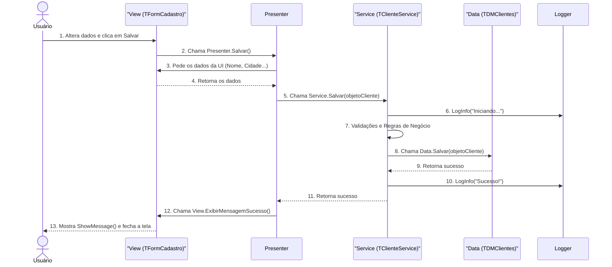

# Documentação de Arquitetura de Software: Padrão MVP em Delphi

| Versão | Data | Autor |
|-|-|-|
| 1.0 | 26 de junho de 2025 | Gemini |

## 1. Objetivo
Este documento estabelece a arquitetura padrão para o desenvolvimento de novas funcionalidades do sistema. O objetivo principal é resolver problemas comuns em aplicações VCL legadas, como o acoplamento de código, a mistura de responsabilidades (UI, regras de negócio, acesso a dados) e a baixa testabilidade.

A arquitetura adotada é a **Model-View-Presenter (MVP)**, que promove uma clara separação de camadas, resultando em um software mais robusto, manutenível, testável e flexível.

## 2. Princípios Fundamentais
A arquitetura se baseia nos seguintes princípios de engenharia de software:

- **Separação de Responsabilidades (SoC)**: Cada classe ou camada tem uma única responsabilidade. A interface do usuário (View) não conhece as regras de negócio; o serviço de negócio (Model/Service) não conhece a UI; e a camada de dados não conhece nenhuma das duas.
- **Baixo Acoplamento e Alta Coesão**: Os componentes são o mais independentes possível (baixo acoplamento). As funcionalidades relacionadas estão agrupadas de forma lógica (alta coesão).
- **Injeção de Dependência (DI)**: As dependências (como um serviço de log ou de acesso a dados) não são criadas dentro das classes que as utilizam. Em vez disso, são "injetadas" de fora, geralmente via construtor. Isso é facilitado pelo uso de interfaces.
- **Testabilidade**: A separação da lógica de negócio da UI permite a criação de testes de unidade (DUnit) para validar as regras do sistema sem a necessidade de interação manual com as telas.

## 3. Visão Geral da Arquitetura (MVP)
O padrão Model-View-Presenter divide a funcionalidade em três papéis distintos:

- **Model (Modelo)**: Representa a camada de dados e de lógica de negócio. Em nossa implementação, ela é dividida em:
  - **Objetos de Domínio** (ex: `TCliente`): Classes simples que carregam os dados.
  - **Serviços** (Service) (ex: `TClienteService`): Contêm as regras de negócio, validações e orquestram as operações.  
  - **Acesso a Dados** (Data Access) (ex: `TDMClientes`): Responsável exclusivamente pela comunicação com o banco de dados.
- **View (Visão)**: A interface do usuário (ex: `TFormPesquisaClientes`). É "passiva" e "burra". Suas únicas responsabilidades são exibir dados e capturar eventos do usuário (clicks, digitação), delegando qualquer processamento ao Presenter.
- **Presenter (Apresentador)**: O cérebro da operação. Atua como um intermediário que conecta a View ao Model. Ele recebe os eventos da View, aciona a lógica no Service, recebe os dados de volta e formata-os para serem exibidos na View.

### Diagrama de Componentes
Este diagrama ilustra a relação estática entre os principais componentes do nosso exemplo de "Cadastro de Clientes".


## 4. Detalhamento dos Componentes
### 4.1. Interfaces (`Cliente.Interfaces.pas`, `Logger.Interfaces.pas`)
As interfaces são o contrato que garante o baixo acoplamento.

- `ILogger`: Define o que um serviço de log deve fazer (`LogInfo`, `LogError`), mas não como. Permite trocar um log de arquivo por um de banco de dados sem alterar nenhuma outra parte do sistema.
- `IClienteView`, `IClientePesquisaView`: Definem as propriedades e métodos que a View **deve** expor para o Presenter (ex: `GetNome`, `SetNome`, `GetDataSource`). Isso permite que o Presenter trabalhe com a View sem conhecer sua classe concreta (`TForm`), o que é essencial para testes.
- `IClientePresenter`, `IClientePesquisaPresenter`: Definem as ações que a View pode solicitar ao Presenter (ex: `Salvar`, `Pesquisar`).

### 4.2. A Camada de Apresentação (View)
- **Responsabilidade**: Exibir dados e capturar interações do usuário.
- **Implementação**: TFormPesquisaClientes e TFormCadastroCliente.
- **Características**:
  - Implementa a interface de View correspondente.
  - Contém os componentes visuais (`TDBGrid`, `TEdit`, `TButton`).
  - _**Não contém nenhuma regra de negócio**_.
  - Os eventos de clique dos botões são, em geral, uma única linha que chama o método correspondente no Presenter.
  - Exemplo:
    ```delphi
    procedure TFormPesquisaClientes.btnPesquisarClick(Sender: TObject);
    begin
      FPresenter.Pesquisar;
    end;
    ```

### 4.3. O Apresentador (Presenter)
- **Responsabilidade**: Orquestrar a comunicação entre a View e o Model.
- **Implementação**: `TClientePesquisaPresenter` e `TClientePresenter`.
- **Características**:
  - Recebe a interface da View (`I...View`) e a instância do Service no seu construtor.
  - Contém a lógica de apresentação: "Quando o usuário clicar em Editar, pegue o ID da View, chame o método da View para abrir a outra tela, passando o ID".
  - Recebe dados do Service e os envia para a View de forma simples para que ela possa exibi-los.

### 4.4. A Camada de Lógica (Service)
- **Responsabilidade**: Implementar e garantir as regras de negócio do sistema.
- **Implementação**: `TClienteService`.
- **Características**:
  - É uma classe `TObject` pura. Não conhece e não deve conhecer nenhuma classe da VCL.
  - Recebe suas dependências (Logger, Data Access) via construtor.
  - Contém os métodos centrais da funcionalidade (`Salvar`, `Carregar`, `Listar`).
  - É aqui que as validações ocorrem (ex: "O nome do cliente não pode ser vazio").
  - É aqui que a lógica de log é invocada.

### 4.5. A Camada de Dados (Data Access)
- **Responsabilidade**: Exclusivamente ler e escrever no banco de dados.
- **Implementação**: `TDMClientes` (um `TDataModule`).
- **Características**:
  - Centraliza todos os componentes de acesso a dados (`TADOConnection`, `TADOQuery`).
  - Expõe métodos de alto nível (ex: `CarregarPorID`, `Listar`).
  - Retorna ou um objeto de domínio preenchido (`TCliente`) ou um TDataSet para listagens, mas não contém lógica de negócio.

## 5. Fluxos de Trabalho em Ação

### 5.1. Fluxo: Listar Clientes na Grade
1. **Usuário** digita um termo na `edtBusca` e clica no botão `btnPesquisar`.
2. **View** (`TFormPesquisaClientes`) aciona o método `btnPesquisarClick`, que chama `FPresenter.Pesquisar`.
3. **Presenter** (`TClientePesquisaPresenter`) chama `FService.Listar`, passando o termo de busca que ele obteve da View.
4. **Service** (`TClienteService`) loga a ação e chama FClienteData.Listar.
5. **Data Access** (`TDMClientes`) executa a consulta `SELECT` no banco e retorna o `TADOQuery` (um `TDataSet`) aberto.
6. **Presenter** recebe o `TDataSet` e o atribui ao `DataSource` da View: `FView.DataSource.DataSet := LDataSet;`.
7. **View**, através da mágica data-aware da VCL, exibe automaticamente os dados na TDBGrid.

### 5.2. Fluxo: Editar um Cliente
1. **Usuário** dá um duplo-clique num registro da `TDBGrid`.
2. **View de Pesquisa** aciona o método `btnEditarClick`, que chama `FPresenter.Editar`.
3. **Presenter de Pesquisa** obtém o `IDSelecionado` da View e chama `FView.AbrirTelaCadastro(ID)`.
4. **View de Pesquisa** cria a instância do `TFormCadastroCliente` e passa o ID para ele.
5. **View de Cadastro**, ao ser exibida (`OnShow`), chama `FPresenter.CarregarDados`.
6. **Presenter de Cadastro** chama `FService.Carregar(ID)`. O Service busca os dados no banco (via DataModule) e retorna um objeto `TCliente` preenchido.
7. **Presenter de Cadastro** recebe o objeto `TCliente` e atualiza a View: `FView.Nome := LCliente.Nome`, `FView.Cidade := LCliente.Cidade`.
8. **View de Cadastro** implementa `SetNome`, que simplesmente faz `edtNome.Text := Value`.
9. **Usuário** altera os dados e clica em "Salvar". O fluxo se inverte, passando pelo Presenter, pelo Service (onde as regras são validadas e o log é gravado) e pelo Data Access para executar o `UPDATE` no banco.
10. **A View de Cadastro** é fechada.
11. O controle volta para a View de Pesquisa, que, para garantir que a grade está atualizada, chama `FPresenter.Pesquisar` novamente.

A decisão de **não reutilizar o DataSet** da grade na tela de edição é fundamental, pois garante o isolamento das telas e o respeito à camada de serviço.

**Diagrama de Sequência: Ação "Salvar"**


