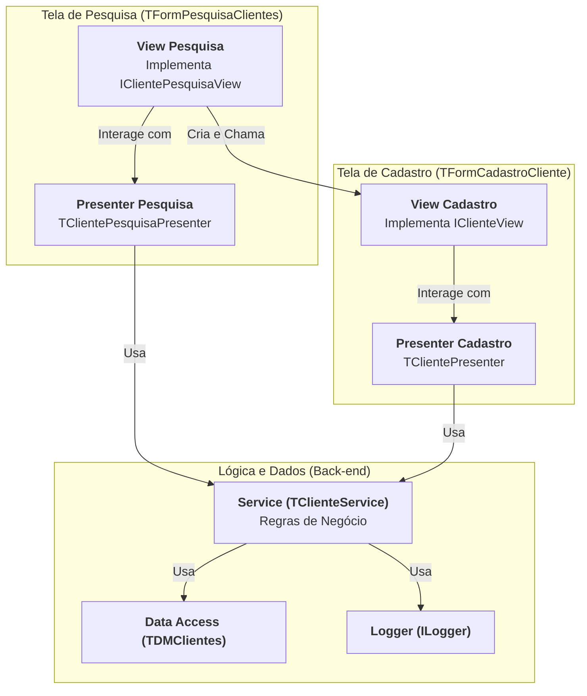

# Documentação de Arquitetura de Software: Padrão MVP em Delphi

| Versão | Data | Autor |
|-|-|-|
| 1.0 | 26 de junho de 2025 | Gemini |

## 1. Objetivo
Este documento estabelece a arquitetura padrão para o desenvolvimento de novas funcionalidades do sistema. O objetivo principal é resolver problemas comuns em aplicações VCL legadas, como o acoplamento de código, a mistura de responsabilidades (UI, regras de negócio, acesso a dados) e a baixa testabilidade.

A arquitetura adotada é a **Model-View-Presenter (MVP)**, que promove uma clara separação de camadas, resultando em um software mais robusto, manutenível, testável e flexível.

## 2. Princípios Fundamentais
A arquitetura se baseia nos seguintes princípios de engenharia de software:

- **Separação de Responsabilidades (SoC)**: Cada classe ou camada tem uma única responsabilidade. A interface do usuário (View) não conhece as regras de negócio; o serviço de negócio (Model/Service) não conhece a UI; e a camada de dados não conhece nenhuma das duas.
- **Baixo Acoplamento e Alta Coesão**: Os componentes são o mais independentes possível (baixo acoplamento). As funcionalidades relacionadas estão agrupadas de forma lógica (alta coesão).
- **Injeção de Dependência (DI)**: As dependências (como um serviço de log ou de acesso a dados) não são criadas dentro das classes que as utilizam. Em vez disso, são "injetadas" de fora, geralmente via construtor. Isso é facilitado pelo uso de interfaces.
- **Testabilidade**: A separação da lógica de negócio da UI permite a criação de testes de unidade (DUnit) para validar as regras do sistema sem a necessidade de interação manual com as telas.

## 3. Visão Geral da Arquitetura (MVP)
O padrão Model-View-Presenter divide a funcionalidade em três papéis distintos:

- **Model (Modelo)**: Representa a camada de dados e de lógica de negócio. Em nossa implementação, ela é dividida em:
  - **Objetos de Domínio** (ex: `TCliente`): Classes simples que carregam os dados.
  - **Serviços** (Service) (ex: `TClienteService`): Contêm as regras de negócio, validações e orquestram as operações.  
  - **Acesso a Dados** (Data Access) (ex: `TDMClientes`): Responsável exclusivamente pela comunicação com o banco de dados.
- **View (Visão)**: A interface do usuário (ex: `TFormPesquisaClientes`). É "passiva" e "burra". Suas únicas responsabilidades são exibir dados e capturar eventos do usuário (clicks, digitação), delegando qualquer processamento ao Presenter.
- **Presenter (Apresentador)**: O cérebro da operação. Atua como um intermediário que conecta a View ao Model. Ele recebe os eventos da View, aciona a lógica no Service, recebe os dados de volta e formata-os para serem exibidos na View.

### Diagrama de Componentes
Este diagrama ilustra a relação estática entre os principais componentes do nosso exemplo de "Cadastro de Clientes".

